# Procedural modeling: Yuanlin

Author: Henry Han, Nico Kong

## Showcase Demo

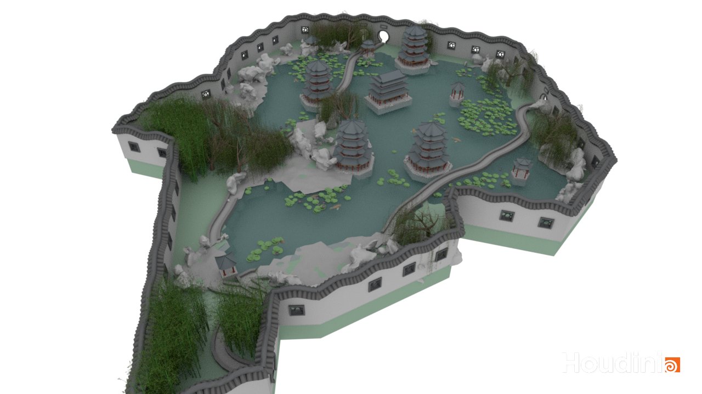

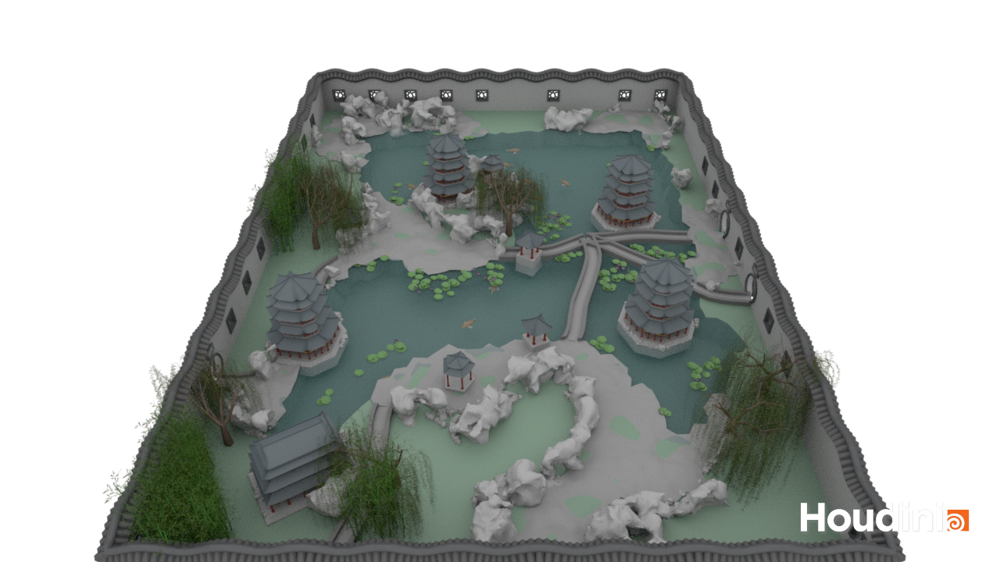

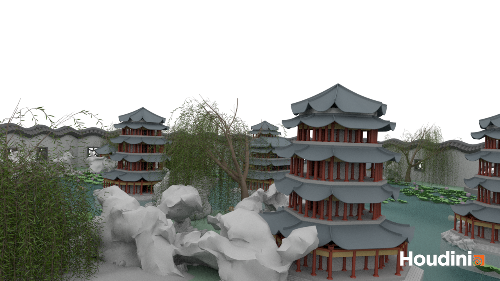

## Terrain & Lakes

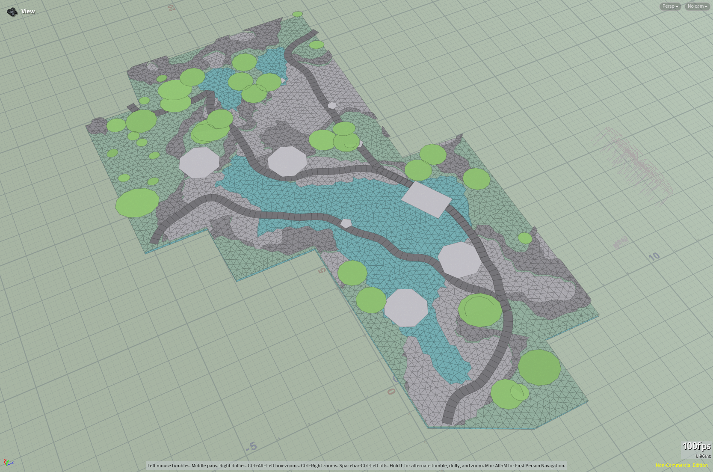

## Paths

## Buildings

## Plants

**Bamboo 👇**

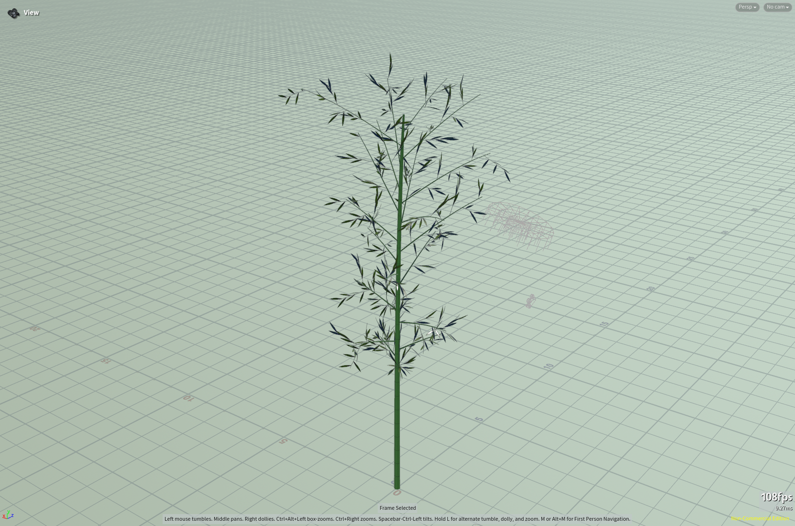

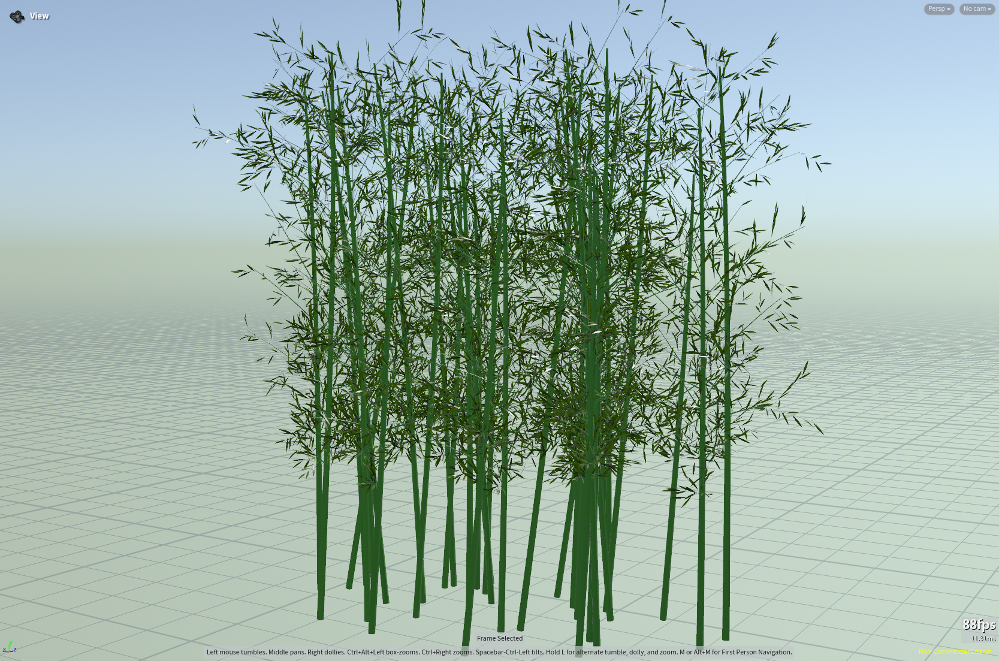

**Willow 👇**

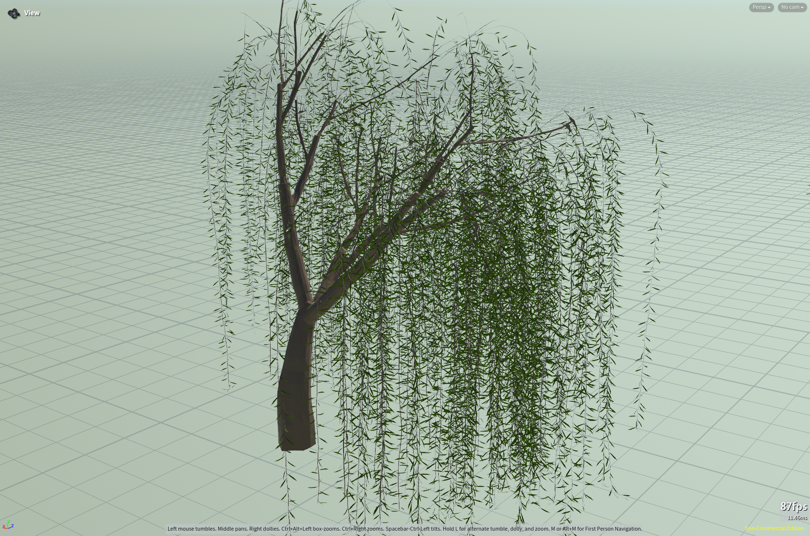

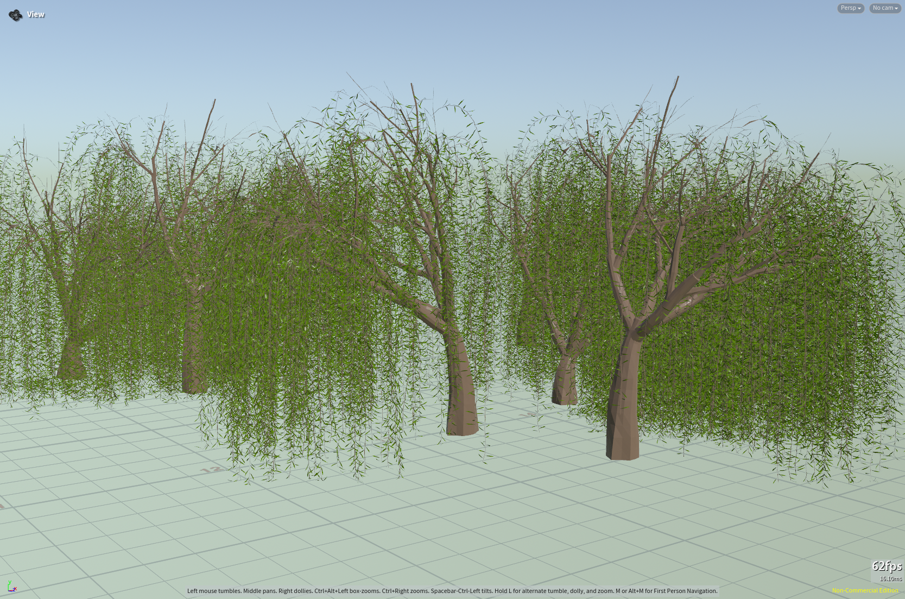

## Rocks

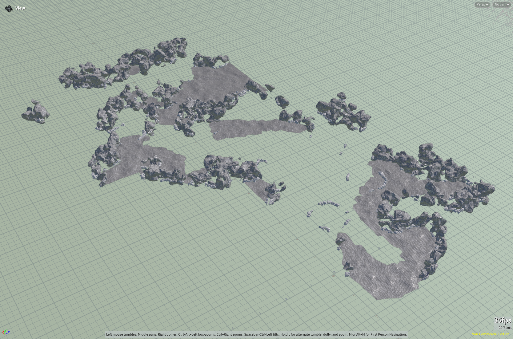

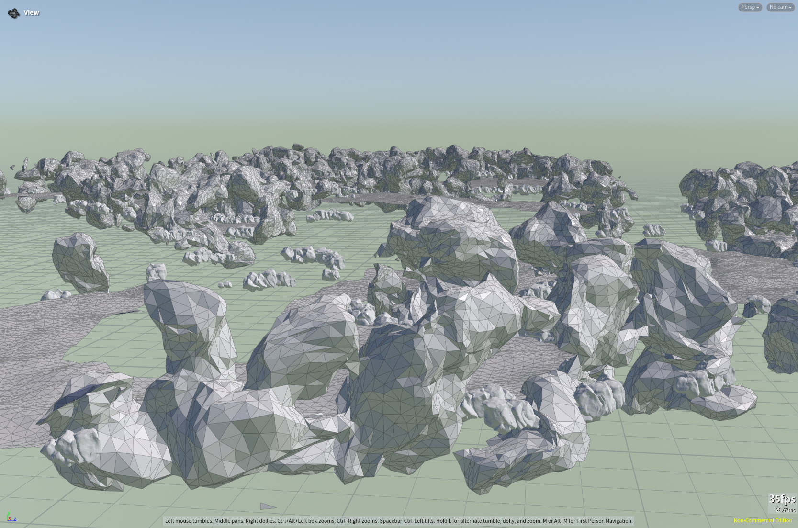

## Walls & Entrance

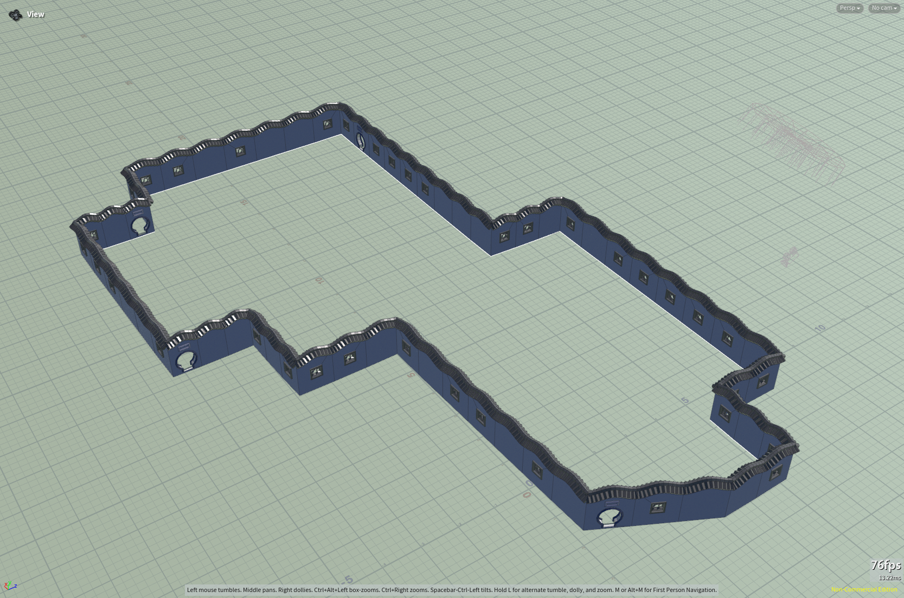

## Introduction

Yuanlin (Chinese garden) is an important art form popular among many officials, poets and businessman in ancient China, and now they are open to public visiting. After visiting many gardens in China and learning Houdini in procedural modeling, I find it really interesting to procedurally generate Chinese gardens since it is asymetric structure and involving with a lot of nature elements. 

## Goal

Produce a method in houdini that can procedurally generate Chinese garden. 

## Inspiration/reference:

[Interactive and Procedural Modeling of Featured Chinese Architectures](https://link.springer.com/chapter/10.1007/978-3-319-53838-9_2)

[Design Analysis of Chinese Classical Garden](https://conservancy.umn.edu/items/a043988e-b843-4ece-9683-8d09d085d91d)

Also some pictures of the most famous Chinese garden (photos from wikipedia)

**Lingering Garden** 👆 (Many stones are surrounding the pool, with 3 small pavilion in between)

**Lion Grove Garden** 👆 (A small pavilion stands on the center of the pool, with surrounding stones and trees. )

**Humble Administrator's Garden** 👆 (The small pavilion is on the left. And the big building is on the right, with an entrance that connects to the bridge)

## Specification:

Procedural modeling of components:

- Buildings (large and small, on land and on water): The buildings are the most complicated part of the garden
- Corridors and walls: These separate the garden into sections
- Trees and rocks: These are the natural components in the garden
- Pools, streams and bridges: Also a very important components in the garden, whether it is built or natural

## Techniques:

L-System / Grammar-based modeling:	Generate paths, isle, wall placement, and pavilion positioning

Noise-based generation:	Create rocks and partitions

## Design:

## Timeline:

Week1: Produce some basic assets, e.g. small pavilion, bridges, willow, rocks. Find a way to place pools and streams
Week2: Refine the buildings and the plants with more styles and parameters
Week3: Try out more ways to put altogether, as well as try rendering
Week4: Finish up

## Progress Update (11/24)

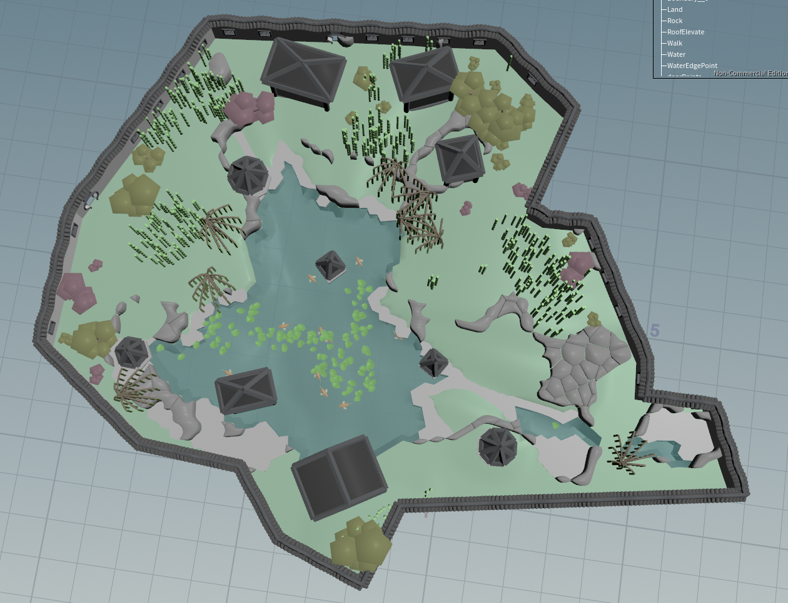